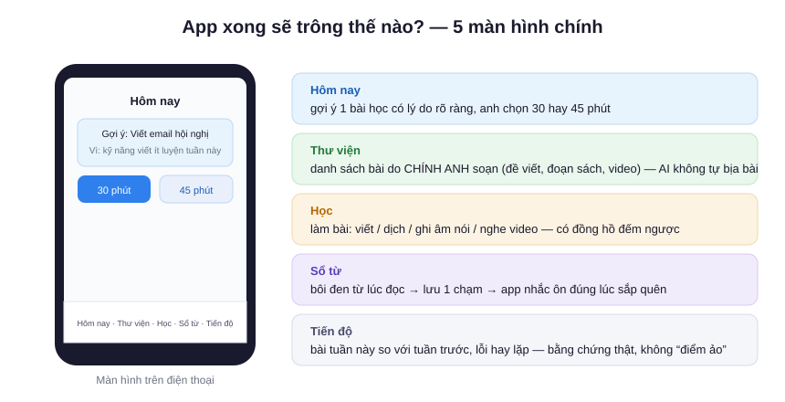
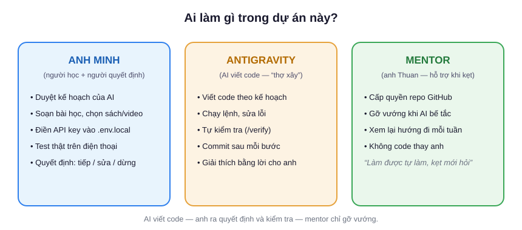
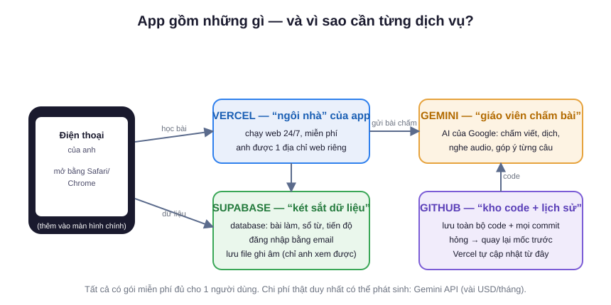
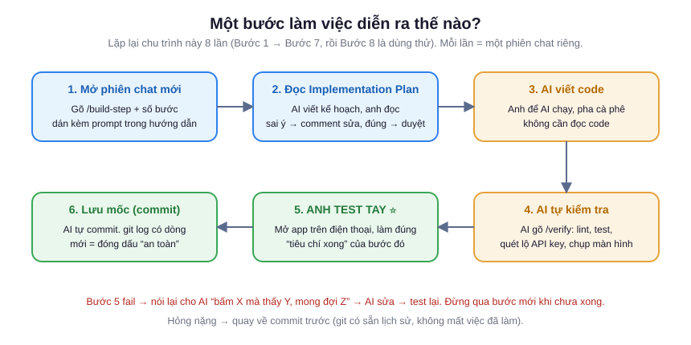
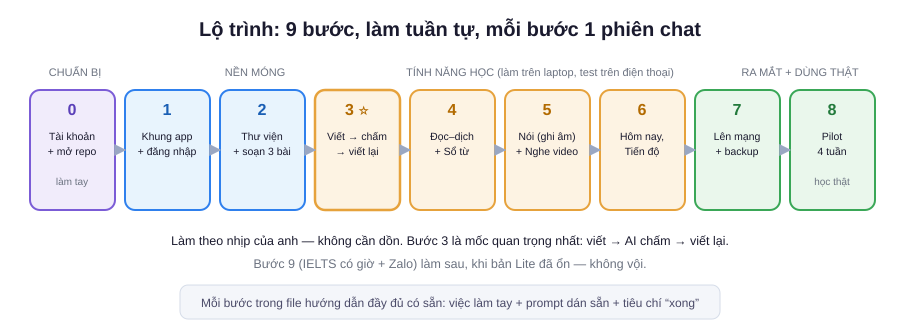

# Anh Minh tự xây English Mini LMS bằng Antigravity

**Đối tượng:** anh Minh — bác sĩ, không cần biết lập trình. Đã cài Antigravity trên máy.
**Nhịp làm:** chia 9 bước nhỏ, mỗi bước một phiên chat — làm theo lịch của anh, không cần dồn.
**Nguyên tắc:** AI (Antigravity) viết toàn bộ code. Anh làm 4 việc AI không thay được: *ra quyết định, soạn bài học, điền API key, test thật trên điện thoại.*

---

## 1. Anh sắp xây cái gì?

Một trang web riêng trên điện thoại để học tiếng Anh 30–45 phút/ngày: viết email hội nghị, đọc–dịch sách y khoa, ghi âm nói, nghe video — mỗi bài đều được AI (Gemini) chấm và góp ý từng chỗ sai.





**Vì sao anh tự build được?** Vì code không còn là rào cản — Antigravity viết hết. Việc khó (và chỉ anh làm được) là: biết mình cần gì, soạn bài học thật, và chịu khó test. Toàn bộ "bản thiết kế" (luật cho AI, prompt từng bước, tiêu chí kiểm tra) đã được chuẩn bị sẵn trong repo — anh chỉ đi theo.

## 2. Vì sao cần 4 dịch vụ này?



| Dịch vụ | Là gì, nói dễ hiểu | Vì sao bắt buộc |
|---|---|---|
| **GitHub** | Kho chứa code + ghi lại mọi lần sửa | Hỏng thì quay lại mốc cũ; là cầu nối để Vercel lấy code |
| **Supabase** | "Két sắt dữ liệu" trên mây | Lưu bài làm, sổ từ, file ghi âm; cấp đăng nhập; chỉ anh đọc được dữ liệu của anh |
| **Google AI Studio** | Nơi lấy "chìa khoá" gọi Gemini | Gemini là giáo viên chấm bài — không có key này app không chấm được |
| **Vercel** | Máy chủ chạy web 24/7 | Biến code thành địa chỉ web mở được trên điện thoại ở bất cứ đâu |

Cả 4 đều có gói miễn phí đủ cho 1 người. Chi phí có thể phát sinh: Gemini API, vài USD/tháng.

> **Vì sao dữ liệu để trên mây?** Để học trên điện thoại ở mọi nơi và backup được. Bài làm/voice của anh được mã hoá, chỉ tài khoản của anh đọc được. Không liên quan gì dữ liệu phòng khám/bệnh nhân — tuyệt đối không đưa vào.

## 3. Chuẩn bị một lần (Bước 0 — làm tay)

### 3.1. Cài 2 phần mềm còn thiếu

| Phần mềm | Tải ở | Kiểm tra (mở Terminal gõ) |
|---|---|---|
| Node.js (bản LTS) | nodejs.org | `node -v` → ra số, vd `v22.x` |
| Git | git-scm.com (Mac thường có sẵn) | `git --version` |

### 3.2. Tài khoản — 2 cái đã có, 2 cái cần tạo

| Tài khoản | Tình trạng | Việc cần làm |
|---|---|---|
| **GitHub** (github.com) | ✅ đã có | Tạo repo **private trống** tên `english-mini-lms` (New repository → **không** tick "Add a README") |
| **Vercel** (vercel.com) | ✅ đã có | Chưa cần làm gì — đến Bước 7 mới dùng |
| **Google AI Studio** (aistudio.google.com) | cần tạo | Đăng nhập Google → "Get API key" → tạo 1 key → **chép ra giấy/notes** |
| **Supabase** (supabase.com) | cần tạo | New project → region **Singapore** → Settings → API: chép `Project URL`, `anon key`, `service_role key`; Database: chép `connection string` |

### 3.3. Tải bộ hồ sơ dự án — clone ngay trong Antigravity

Repo mẫu là "bộ hồ sơ thi công" đã chuẩn bị sẵn: luật bắt buộc cho AI, prompt từng bước, tiêu chí kiểm tra, khuôn soạn bài học. Anh tải về rồi đưa lên repo **của chính mình** — để code, lịch sử và quyền deploy sau này thuộc về anh.

1. Mở Antigravity → ở **màn hình chính** (trang chủ) chọn **Clone Git Repository** → dán:
   `https://github.com/thuanyogi/english-mini-lms.git`
   → chọn thư mục lưu trên máy (ví dụ `Projects`) → Antigravity tự tải về và mở workspace. Repo nguồn đang **public** nên không cần xin quyền.
2. Trong khung chat của Antigravity, dán prompt này để AI chuyển repo về tài khoản của anh:

```
Đổi remote "origin" của repo này sang https://github.com/<username-cua-anh>/english-mini-lms.git
rồi push nhánh master lên. <username-cua-anh> là username GitHub của tôi; repo đó là repo
private trống tôi vừa tạo. Nếu GitHub yêu cầu đăng nhập, hướng dẫn tôi từng bước bằng lời.
```

**Kiểm tra:** mở trang repo của anh trên GitHub → thấy đủ thư mục `docs`, `.agents`, `content`, `AGENTS.md` là đúng. Từ giờ mọi commit của anh đi lên repo của anh.

### 3.4. Mở trong Antigravity

1. Sau khi clone ở 3.3, Antigravity đã mở sẵn workspace `english-mini-lms` (lần sau: **Open Workspace** → chọn đúng thư mục đó).
2. Vào menu `…` → **Customizations**: phải thấy rule `english-mini-lms` và 2 workflow `/build-step`, `/verify`. Thiếu → nhắn mentor.
3. Tạo file `.env.local` ngay trong thư mục (Antigravity: chuột phải → New File), dán khung này rồi điền giá trị thật đã chép ở 3.2:

```
NEXT_PUBLIC_SUPABASE_URL=
NEXT_PUBLIC_SUPABASE_ANON_KEY=
SUPABASE_SERVICE_ROLE_KEY=
DATABASE_URL=
GEMINI_API_KEY=
```

> **Vì sao file này quan trọng?** Đây là "chìa khoá tủ" — app đọc key từ đây để nói chuyện với Supabase và Gemini. File này **không bao giờ** được dán vào chat, không lên GitHub (repo đã cấu hình sẵn chặn). AI hỏi key → trả lời: *"Đã có trong .env.local."*

**Xong Bước 0 khi:** `node -v` chạy được; có đủ 4 tài khoản (GitHub/Vercel có sẵn + AI Studio/Supabase mới tạo); repo đã về máy và push được lên repo của anh; Antigravity thấy rules/workflows; `.env.local` điền đủ 5 dòng.

## 4. Cách một bước diễn ra



**5 quy tắc vàng:**

1. **Luôn đọc Implementation Plan trước khi duyệt.** AI sẽ viết kế hoạch — anh đọc, chưa đúng ý thì comment sửa, rồi mới bấm duyệt cho code.
2. **Một phiên chat = một bước.** Đừng gộp. Xong bước → mở phiên mới → gõ `/build-step <số>`.
3. **Không dán API key vào chat.** Bao giờ cũng thế.
4. **Tin nhưng kiểm.** AI báo "xong" không tính — anh phải tự mở app trên điện thoại làm đúng "tiêu chí xong" của bước đó.
5. **Commit sau mỗi bước** = đóng dấu mốc an toàn. Hỏng → quay lại mốc trước, không mất việc.

**Từ ngữ sẽ gặp trong Antigravity:** *Agent Manager* (màn hình giao việc), *Editor* (xem code), *Artifacts* (bản plan/walkthrough/screenshot để anh review), *Browser subagent* (AI tự mở Chrome bấm thử web), *Implementation Plan* (kế hoạch chờ anh duyệt).

## 5. Lộ trình 9 bước



| Bước | Anh được gì | Việc anh tự làm (AI không làm thay) |
|---|---|---|
| 0 | Môi trường sẵn sàng | Cài Node/Git, tạo tài khoản Supabase + AI Studio, clone repo, điền `.env.local` |
| 1 | App chạy, đăng nhập được | Đăng ký email lần đầu; tắt public signup trong Supabase theo hướng dẫn |
| 2 | Thư viện có bài thật | **Soạn 3 bài**: 1 đề email hội nghị, 1 đoạn sách siêu âm ~150 từ, 1 đề giới thiệu bản thân |
| 3 ⭐ | Viết → chấm → viết lại | Viết thật 1 email trên điện thoại, đọc góp ý, viết bản 2 |
| 4 | Đọc–dịch + sổ từ | Dịch đoạn sách thật, bôi đen lưu từ |
| 5 | Ghi âm nói + nghe video | Chọn 1 video YouTube hội nghị, gõ transcript đoạn 60s |
| 6 | Gợi ý học + ôn từ + tiến độ | Học thật vài phiên để có dữ liệu xem |
| 7 | App trên mạng + backup | Nhập 5 biến môi trường trên Vercel, thêm app ra màn hình chính |
| 8 | Dùng thử 4 tuần | **Học thật** theo gợi ý mỗi ngày; cuối tuần 4 so bài với tuần 1 |
| 9 | (Sau này) IELTS có giờ, Zalo | Cân nhắc khi Lite đã ổn |

👉 **Mỗi bước:** mở file đầy đủ [huong-dan-xay-dung-voi-antigravity.md](huong-dan-xay-dung-voi-antigravity.md) → tìm "Bước N" → làm phần tay → dán prompt sẵn có vào Antigravity → kiểm theo "tiêu chí xong".

## 6. Xử lý tình huống

| Tình huống | Anh làm |
|---|---|
| AI viết plan sai ý / sửa ngoài phạm vi | Từ chối plan, comment "chỉ làm mục X trong bước N". Đã lỡ sửa → `git checkout .` |
| AI hỏi API key | Trả lời: "Đã có trong .env.local, đọc tên biến từ .env.example" |
| Lệnh báo lỗi | Copy nguyên dòng lỗi dán vào chat: "Lỗi này là gì, sửa nguyên nhân gốc" |
| Góp ý Gemini chung chung/không sát | Đây là lúc sửa *prompt chấm*: nói "Feedback đang [vấn đề], sửa prompt trong gemini.ts để [yêu cầu]" |
| Điện thoại không ghi âm | Dùng Safari/Chrome, không dùng trình duyệt trong Zalo |
| Chat quá dài, AI "quên" | Mở phiên mới, `/build-step N` đọc lại tài liệu |
| Kẹt >30 phút không ra | **Gọi mentor** — chụp màn hình lỗi + nói đang ở bước nào |

## 7. Mentor hỗ trợ gì — và không hỗ trợ gì

- **Hỗ trợ:** gỡ lỗi khi AI bế tắc, xem lại hướng đi cuối mỗi tuần, trả lời thắc mắc khái niệm.
- **Không làm thay:** code, điền key, soạn bài, test — vì mục tiêu là anh tự chủ được hệ thống của mình.

## 8. Xong bản Lite khi anh tự tay làm được (trên điện thoại)

- [ ] Đăng nhập; "Hôm nay" gợi ý bài có lý do; chọn 30/45 phút
- [ ] Viết bài → nộp → góp ý đúng chỗ sai → viết bản 2 → thấy 2 bản cạnh nhau
- [ ] Dịch đoạn sách → góp ý chỉ đúng chỗ; bôi đen lưu từ 1 chạm
- [ ] Ghi âm nói → transcript → ≤3 góp ý → nói lại
- [ ] Nghe video → trả lời trước → mở transcript sau
- [ ] Xem đáp án trước nộp → bài gắn nhãn "Có hỗ trợ"
- [ ] Tài khoản khác không đọc được bài của anh
- [ ] Backup chạy được; `.env.local` không lên GitHub

---

*Tài liệu đầy đủ trong repo: [hướng dẫn từng bước + prompt](huong-dan-xay-dung-voi-antigravity.md) · [phạm vi bản Lite](lite-mvp-track.md) · [thiết kế sản phẩm](product-design.md).*
